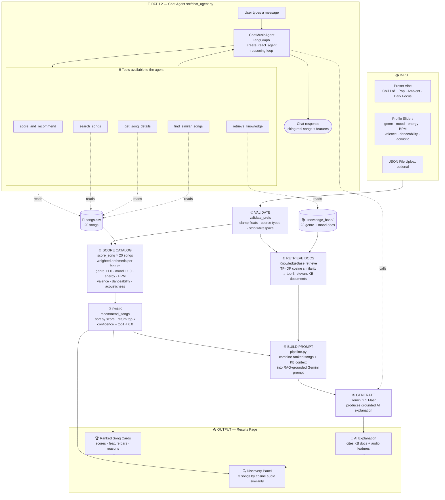

# 🎵 My Vibe — AI Music Recommender

---

## Original Project (Module 3)

**My Vibe v1.0** was a content-based music recommender built in Module 3. It represented each song as a set of numeric audio features: genre, mood, energy, BPM, valence, danceability, and acousticness, and scored every song in a 20-song catalog by measuring how closely those features matched a user's taste profile using weighted arithmetic. The system ranked all songs, returned the top-k results with a plain-English scoring explanation per song in the terminal, and was stress-tested against normal profiles and adversarial edge cases (unknown genre labels, missing fields, conflicting preferences) to identify where a pure rule-based model breaks down.

---

## Title and Summary

**My Vibe** is an AI-powered music recommendation system that takes a user's taste profile and returns personalized song picks with a knowledge-grounded explanation, a similarity discovery panel, and a conversational chat agent that answers free-text questions about music.

It matters because most recommendation systems are black boxes, they return results but don't explain why. My Vibe shows its work as every score comes with a reason, every AI explanation cites the knowledge document it drew from, and every chat agent response shows which tools it called before answering.   

Built across four modules in applied AI engineering: RAG, agentic tool-use, few-shot prompting, and automated evaluation.

---

## System Diagram




---

## Architecture Overview

The system is organized in five layers, each with a distinct job.

**User Input** — The profile builder is the entry point. Users pick a preset vibe (Chill Lofi, Upbeat Pop, Soft Ambient, Dark Focus) or configure sliders manually across seven dimensions: genre, mood, energy, BPM, valence, danceability, and acoustic preference. They can also upload a JSON profile file. All inputs flow through `validate_prefs()` — a guardrail function that clamps out-of-range floats, coerces type mismatches, strips whitespace, and logs warnings — before anything else happens.

**Data Layer** — Two static data sources: `data/songs.csv` holds 20 songs with fully numeric audio features, and `data/knowledge_base/` holds 23 plain-text documents (one per genre and mood) written to be retrievable by keyword search. No database, no external service — both load from disk at startup.

**Core Recommender** — `score_song()` applies weighted arithmetic across all features: discrete matches (genre, mood) award full points and continuous features (energy, BPM, valence, danceability, acousticness) award partial points based on proximity to the target. `recommend_songs()` scores the entire catalog and returns the top-k sorted by score. This layer is entirely deterministic — no randomness, no API.

**RAG + AI Layer** — The pipeline fits a TF-IDF vectorizer over the 23 KB documents at startup. When a profile arrives, it constructs a text query from the numeric values ("lofi chill low energy acoustic") and retrieves the 3 most cosine-similar documents. Those documents are inserted into a structured Gemini prompt alongside the ranked song list, grounding the AI explanation in real genre/mood knowledge. `GeminiClient` wraps the `google-genai` SDK with graceful degradation — if no API key is present, every call returns a clear placeholder message instead of crashing.

**LangChain Chat Agent** — `ChatMusicAgent` uses LangGraph's `create_react_agent` with 5 tools: `search_songs`, `get_song_details`, `find_similar_songs`, `score_and_recommend`, and `retrieve_knowledge`. When the user types a free-text message, the agent decides which tools to call, calls them in sequence, and synthesizes a response citing real catalog data. Tool calls are captured and rendered in a UI expander so the reasoning is always visible.

**Evaluation** — `scripts/evaluate.py` defines 8 test profiles (3 primary with clear genre/mood targets and 5 edge cases covering conflicting preferences, unknown labels, type coercion traps, and sparse input) and runs each through the recommender with explicit pass/fail criteria. 22 `pytest` tests cover the scoring logic, RAG retrieval precision, and the full evaluation harness. The harness and `pytest` suite call the **deterministic recommender (and RAG retrieval structure)** only—they **do not** call Gemini or the chat agent, so scores stay reproducible without live LLM dependencies.

### Stretch scope (for grading clarity)

- **Multi-source:** Here that means **combined catalog + knowledge base**: rankings come from weighted scoring over `songs.csv`, while **TF‑IDF retrieval** runs over the 23 KB `.txt` files only (one vector index over the KB, not a second index over songs); the chat agent can still **read both** via tools.
- **Few-shot depth comparison:** Run from the **CLI** with `python -m src.main --fewshot` (not surfaced in the Streamlit UI).
- **Evaluation harness:** `scripts/evaluate.py` / `python -m src.main --evaluate` invoke **`recommend_songs` on fixed profiles** and print a pass/fail summary—they **do not** exercise Gemini or agent endpoints.

---

## Setup Instructions

### 1. Clone the repo

```bash
git clone <your-repo-url>
cd applied-ai-project
```

### 2. Create a virtual environment

```bash
python3 -m venv .venv
source .venv/bin/activate        # macOS / Linux
.venv\Scripts\activate           # Windows
```

### 3. Install dependencies

```bash
pip install -r requirements.txt
```

### 4. Add your Gemini API key

Create a `.env` file in the project root:

```
GEMINI_API_KEY=your_actual_key_here
```

Get a free key at [aistudio.google.com](https://aistudio.google.com). The app runs without a key — AI explanation and chat features display a fallback message instead of crashing.

### 5. Run the app

```bash
streamlit run app.py
```

Open `http://localhost:8501`. The landing page is the profile builder — pick a preset or configure sliders, then click **Find My Music**. Results, AI explanation, similarity discovery, and the chat agent all appear on the same page. Click **Edit profile** to return to the builder.

### 6. Run tests

```bash
pytest tests/ -v                 # 22 unit tests
python scripts/evaluate.py       # 8-profile evaluation report
```

---

## Sample Interactions

### Interaction 1 — Chill Lofi Profile

**Input (via profile form):**

```
Genre: lofi  |  Mood: chill  |  Energy: 0.42  |  BPM: 78  |  Valence: 0.58  |  Acoustic: yes
```

**Recommender output:**

```
#1  Midnight Coding — LoRoom           score 5.84 / 6.00  (genre match  mood match  energy 0.42)
#2  Library Rain — Paper Lanterns      score 5.73 / 6.00  (genre match  mood match  energy 0.35)
#3  Focus Flow — LoRoom               score 4.83 / 6.00  (genre match  energy 0.40)
#4  Spacewalk Thoughts — Orbit Bloom  score 4.43 / 6.00  (mood match  energy 0.28)
#5  Coffee Shop Stories — Slow Stereo score 3.67 / 6.00  (energy close)
```

**AI explanation (RAG-grounded, excerpt):**

> *"These lo-fi tracks align with your preference for low-energy acoustic listening. Midnight Coding and Library Rain both sit in the 72–78 BPM range characteristic of lo-fi hip-hop — a tempo shown in psychoacoustic research to reduce cognitive load. Their acousticness scores above 0.70 reinforce the organic warmth that defines the genre, and their valence values near 0.55 reflect the bittersweet emotional quality that makes lo-fi effective for sustained focus."*

**Discovery panel** — songs with similar audio DNA to Midnight Coding (not in your top picks):

```
Willow & Ember — folk      energy 0.31   match 77%
Low Tide Blues — blues     energy 0.33   match 72%
Dust Road Echoes — country energy 0.55   match 66%
```

---

### Interaction 2 — Upbeat Pop Profile

**Input:**

```
Genre: pop  |  Mood: happy  |  Energy: 0.85  |  BPM: 120  |  Acoustic: no
```

**Recommender output:**

```
#1  Sunrise City — Neon Echo       score 5.33 / 6.00  (genre match  mood match  energy 0.82)
#2  Gym Hero — Max Pulse           score 4.21 / 6.00  (genre match  energy 0.93)
#3  Rooftop Lights — Indigo Parade score 4.12 / 6.00  (genre match  mood match  energy 0.76)
#4  Voltage Verse — Kai Cipher     score 3.19 / 6.00  (energy close)
#5  Calle Sin Fin — Nova Ritmo     score 3.14 / 6.00  (energy close)
```

**Confidence:** 0.89 — top-1 vs top-2 gap of 1.12 pts, meaning the system has high certainty in its top pick.

---

### Interaction 3 — Sparse Profile (no genre or mood)

**Input:**

```
Energy: 0.45  |  Valence: 0.30  |  Acoustic: no   (no genre or mood specified)
```

**Recommender output:**

```
#1  Midnight Coding — LoRoom       score 2.46
#2  Dust Road Echoes — Clay Mercer score 2.43
#3  Glass Cathedrals — Null Trace  score 2.38
```

Without genre and mood, the system loses up to 2.0 pts of possible score. Confidence drops to 0.41 and the gap between candidates is only 0.08 pts. The system still returns results rather than crashing, but the low scores and narrow spread are direct signals that more profile information would meaningfully improve the output.

---

### Interaction 4 — Chat Agent

**User message:** `"recommend something chill for studying"`

**Agent tool calls (shown in UI expander):**

```
→ retrieve_knowledge("chill studying focus low energy")
→ score_and_recommend(genre="lofi", mood="chill", energy_level="low")
```

**Agent response (excerpt):**

> *"For a focused study session, I'd recommend Library Rain by Paper Lanterns. At 72 BPM with an energy score of 0.35 and acousticness of 0.81, it sits in the psychoacoustically optimal range for sustained concentration. Midnight Coding by LoRoom is another strong pick — 78 BPM, energy 0.42 — offering slightly more presence if you find very quiet music distracting. Both have valence near 0.55, the bittersweet quality that reduces emotional arousal without inducing sadness."*

---

## Project Structure

```
applied-ai-project/
├── app.py                        # Streamlit frontend (profile-centric, single page)
├── data/
│   ├── songs.csv                 # 20-song catalog with numeric audio features
│   └── knowledge_base/           # 23 genre + mood .txt docs (RAG source)
│       ├── genre_lofi.txt
│       ├── genre_ambient.txt
│       ├── mood_chill.txt
│       └── ...
├── src/
│   ├── recommender.py            # Core scorer + ranker (deterministic, no API)
│   ├── pipeline.py               # Integrated pipeline: score → RAG → Gemini
│   ├── rag.py                    # TF-IDF KnowledgeBase: load, retrieve, build_context
│   ├── gemini_client.py          # Gemini 2.5 Flash wrapper with graceful degradation
│   ├── chat_agent.py             # LangChain agent: 5 tools + ChatMusicAgent class
│   ├── fewshot.py                # FewShotRecommender + depth metrics
│   ├── agent.py                  # 5-step observable MusicAgent (CLI)
│   ├── main.py                   # CLI entry point
│   └── logger.py                 # Structured logger
├── scripts/
│   └── evaluate.py               # Evaluation harness: 8 profiles, pass/fail report
├── tests/
│   ├── test_recommender.py       # Scoring, ranking, explanation strings
│   ├── test_rag.py               # KB loading, retrieval structure, genre doc precision
│   └── test_evaluate.py          # All profiles pass, top-1 thresholds, no exceptions
├── .env                          # GEMINI_API_KEY (git-ignored)
└── requirements.txt
```

---

## CLI

The original terminal interface is fully preserved:

```bash
python -m src.main                  # top-5 for the default chill lofi profile
python -m src.main --all-profiles   # all profiles side by side
python -m src.main --rag            # RAG before/after depth comparison
python -m src.main --agent          # 5-step agentic workflow with logged steps
python -m src.main --fewshot        # few-shot vs zero-shot depth comparison
python -m src.main --evaluate       # full evaluation harness (8 profiles)
python scripts/evaluate.py          # same evaluation run directly
```

See **Stretch scope (for grading clarity)** under Architecture Overview for what “multi-source” means here, where to run few-shot, and what the evaluation harness does not call.

---

## Tech Stack


| Component     | Library / Tool                            |
| ------------- | ----------------------------------------- |
| Frontend      | Streamlit                                 |
| Recommender   | Pure Python                               |
| RAG retrieval | scikit-learn (TF-IDF + cosine similarity) |
| AI model      | Gemini 2.5 Flash via google-genai SDK     |
| Chat agent    | LangChain + LangGraph                     |
| Testing       | pytest                                    |
| Data handling | pandas, numpy                             |
| Config        | python-dotenv                             |


